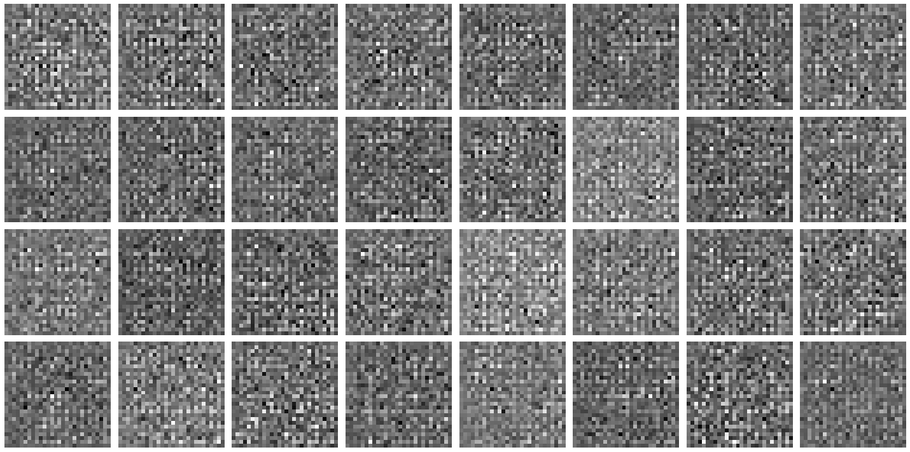
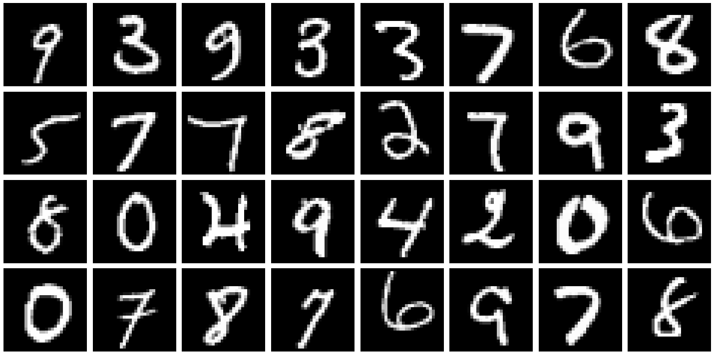

# MNIST Deep Convolution Generative Adverserial Network

Tensorflow implementation of Deep Convolution Generative Adversarial Networks (DCGAN) for MNIST dataset.

Mnist-gan is a GAN(Generative Adversarial Network) that learns how to generate images that look like mnist digits. Separate networks are trained for each digit. The idea is to train a generator network which when fed noise (in my case a 128 dimensional random vector) will generate an image that looks like an mnist style 8 (for example). In essence the network is finding a function of 128 variables that returns a matrix of pixels that look like an eight. Mind bending! You can see how the digit starts to take shape from the noise.

This is what the generated actually generated before training.

## Results

These are the results after training for 500 epochs.

## Generator and Discriminator loss curves

There are some bumps both for generator and discriminator but on an average both stays almost at the same loss.

## Implementation details

- Batch size: 128
- Learning rate: 1e-4
- Epochs: 500
- Optimizer: Adam

### Learning time

- 7 secs per epoch
- Total time: almost 1 hr

## Dataset

    MNIST

**You can download the dataset by clicking** [here](http://yann.lecun.com/exdb/mnist/)

## Development Environment

- Windows 10
- Tensorflow v2.9.1
- Keras API v2.9.0
- Python v3.9.7
- Numpy v1.22.2
- Matplotlib v3.2.2